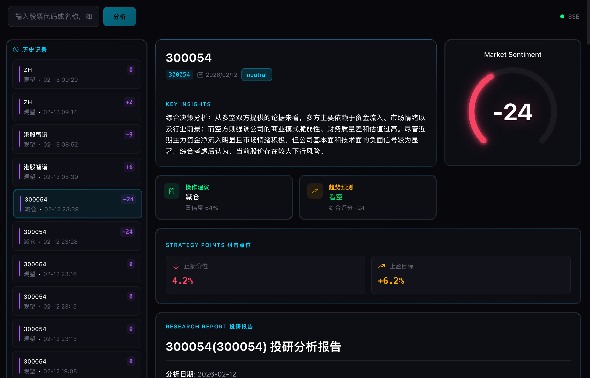
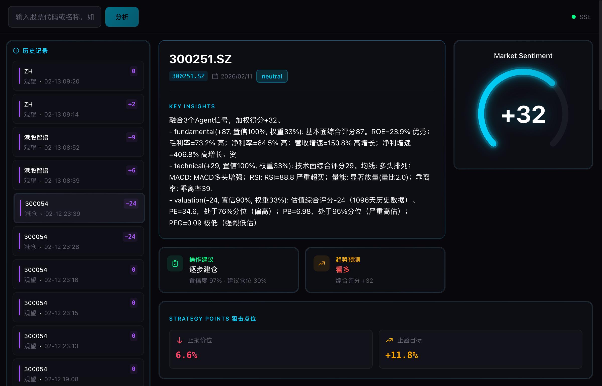

# AI 投研助手

全维度多 Agent 协作的 AI 投研分析系统。9 大分析维度并行研判，5 种市场环境自适应权重，3 梯度 LLM 路由策略，覆盖 A 股 / 港股 / 美股。



## 功能概览

### 9 大分析维度

系统内置 9 个独立分析 Agent，基于 LangGraph DAG 并行执行（fan-out → fan-in），每个 Agent 输出标准化信号（评分 -100~+100 + 置信度 + 关键因素 + 风险项）：

| Agent | 维度 | 分析模式 | 核心指标 |
|-------|------|---------|---------|
| `technical` | 技术面 | 代码计算 + LLM 微调(±15) | MA 排列、MACD、RSI、量能、乖离率 |
| `fundamental` | 基本面 | 代码计算 + LLM 微调(±40) | ROE、毛利率、净利率、营收增速、现金流 |
| `valuation` | 估值 | 代码计算 + LLM 微调(±40) | PE/PB 历史分位、PEG、同行比较 |
| `money_flow` | 资金面 | 代码计算 + LLM 微调(±15) | 主力净流入、大小单博弈、量价关系 |
| `sentiment` | 情绪面 | 代码计算 + LLM 微调(±40) | 新闻情感、重大事件、舆情趋势 |
| `moat` | 护城河 | LLM 主导 | 转换成本、网络效应、无形资产、规模优势 |
| `business_model` | 商业模式 | LLM 主导 | 收入结构、客户集中度、定价权、毛利质量 |
| `industry` | 行业 | LLM 主导 | 产能周期、渗透率、政策环境、竞争格局 |
| `supply_chain` | 产业链 | LLM 主导 | 上下游议价、库存周期、毛利分布 |

### 3 梯度 LLM 路由

| 梯度 | 模式 | Agent | 说明 |
|------|------|-------|------|
| **Mode A** | `enhance` | technical, fundamental, valuation, money_flow, sentiment | 代码先算基础分 → LLM 阅读数据做 ±N 微调 |
| **Mode B** | `primary` | moat, business_model, industry, supply_chain | 缺乏结构化数据，由 LLM 直接推理打分 |
| **Mode C** | `fusion` | fusion + report | 融合 9 路信号 → 仲裁矛盾 → 生成投研报告 |

默认使用本地 Ollama (Qwen 2.5 14B)，零 API 成本。也支持 OpenAI / Anthropic 云端 API。

### 5 种市场环境预设

根据 `config/weights.yaml` 中的市场环境（regime），自动调整各维度权重：

| 市场环境 | 侧重 | 典型权重分配 |
|---------|------|------------|
| **Bull 牛市** | 技术面 + 资金面 + 行业 | 动量驱动，追踪趋势和资金流 |
| **Bear 熊市** | 基本面 + 估值 + 护城河 | 防御为主，重视安全边际 |
| **Neutral 震荡** | 均衡配置 | 各维度权重相对均匀 |

内置否决规则：ST 股封顶 -50 分、退市风险强制 -100、停牌 / 次新股(< 60 天)自动跳过。

### 数据来源

多源自动降级（5 分钟熔断器），确保数据采集高可用：

| 数据类型 | 主数据源 | 降级链 | 说明 |
|---------|---------|--------|------|
| K 线 / OHLCV | BaoStock (TCP) | → EFinance → AKShare → YFinance | BaoStock 走独立 TCP 协议，不受 HTTP 代理影响 |
| 财务报表 | AKShare | → EFinance → TuShare | ROE / 毛利率 / 净利率等 |
| 资金流向 | AKShare | → EFinance | 主力净流入 / 大小单博弈 |
| 新闻舆情 | Tavily / Bocha 搜索 | → Brave → SerpAPI | 多 Key 轮换，搜索引擎 fallback |
| 港股 / 美股 | YFinance | — | 国际市场数据 |

技术指标（MA / MACD / RSI / KDJ 等）由 NumPy / Pandas 本地计算，不依赖第三方指标库。

## 截图

**看空报告** — 300054 鼎龙股份（综合评分 -24）：


**看多报告** — 300251.SZ 光线传媒（综合评分 +32）：



界面采用金融终端暗黑风格：深黑背景、渐变边框卡片、青色主调、环形情绪仪表盘。三区布局：顶部搜索栏 + 左侧历史记录 + 右侧报告区。

## 项目结构

```
ai-investment-analysis/
├── config/                                 # ===== 配置 =====
│   ├── agents.yaml                         #   Agent 配置（启用/LLM/温度/超时）
│   ├── weights.yaml                        #   市场环境权重（bull/bear/neutral）
│   ├── screening.yaml                      #   量化筛选因子
│   └── settings.py                         #   Pydantic Settings 管理
│
├── src/                                    # ===== Python 后端 =====
│   ├── cli.py                              #   CLI 入口（analyze/screen/serve 等）
│   ├── server.py                           #   Uvicorn 入口
│   │
│   ├── api/                                #   FastAPI Web 层
│   │   ├── app.py                          #     应用工厂（CORS/静态文件/SPA fallback）
│   │   └── v1/
│   │       ├── endpoints/analysis.py       #       POST /analyze, SSE /tasks/stream
│   │       ├── endpoints/history.py        #       GET /history, GET /history/{run_id}
│   │       └── schemas/                    #       Pydantic 请求/响应模型
│   │
│   ├── services/                           #   服务层（CLI + API 共用）
│   │   ├── analysis_service.py             #     数据采集 + 分析执行
│   │   ├── history_service.py              #     历史记录查询
│   │   ├── stock_search.py                 #     股票代码模糊搜索
│   │   └── task_queue.py                   #     异步任务队列 + SSE 广播
│   │
│   ├── agents/                             #   LangGraph 分析引擎
│   │   ├── graph.py                        #     DAG 编排（fan-out → fan-in）
│   │   ├── state.py                        #     共享状态定义
│   │   ├── llm_enhance.py                  #     LLM 增强 & 评分微调
│   │   ├── analysts/                       #     9 个分析 Agent
│   │   │   ├── technical.py                #       技术面
│   │   │   ├── fundamental.py              #       基本面
│   │   │   ├── valuation.py                #       估值
│   │   │   ├── money_flow.py               #       资金面
│   │   │   ├── sentiment.py                #       情绪面
│   │   │   ├── moat.py                     #       护城河
│   │   │   ├── business_model.py           #       商业模式
│   │   │   ├── industry.py                 #       行业
│   │   │   └── supply_chain.py             #       产业链
│   │   ├── fusion/engine.py                #     决策融合（加权 + 规则 + LLM 仲裁）
│   │   └── prompts/                        #     LLM Prompt 模板（.md）
│   │
│   ├── data/
│   │   ├── sources/                        #   数据源适配器（auto-fallback）
│   │   │   ├── manager.py                  #     DataSourceManager（熔断/降级）
│   │   │   ├── baostock_source.py          #     BaoStock（A 股 K 线，TCP 协议）
│   │   │   ├── akshare_source.py           #     AKShare（A 股财务/资金流）
│   │   │   ├── efinance_source.py          #     EFinance（A 股）
│   │   │   ├── yfinance_source.py          #     YFinance（港美股）
│   │   │   └── tushare_source.py           #     TuShare（A 股）
│   │   └── storage/                        #   数据库 & 持久化
│   │       ├── models.py                   #     SQLAlchemy ORM
│   │       ├── database.py                 #     连接管理（SQLite/PostgreSQL）
│   │       └── persist.py                  #     分析结果入库
│   │
│   ├── llm/router.py                       #   LLM 路由 + 成本追踪（OpenAI/Anthropic/Ollama）
│   ├── report/generator.py                 #   投研报告生成（Markdown）
│   ├── screening/engine.py                 #   量化筛选引擎
│   ├── notification/manager.py             #   推送（微信/飞书/Telegram/邮件）
│   └── scheduler/scheduler.py              #   APScheduler 定时调度
│
├── web/                                    # ===== React 前端 =====
│   ├── package.json                        #   React 19 + Zustand + TailwindCSS 4 + Vite 7
│   ├── vite.config.ts                      #   开发代理 /api → :8000
│   └── src/
│       ├── App.tsx                         #   三区布局 + SSE 集成
│       ├── index.css                       #   终端暗黑主题（渐变边框/毛玻璃）
│       ├── types/index.ts                  #   TypeScript 类型定义
│       ├── api/client.ts                   #   Axios 客户端
│       ├── hooks/useTaskStream.ts          #   SSE 自动重连 hook
│       ├── stores/analysisStore.ts         #   Zustand 状态管理
│       └── components/
│           ├── StockInput.tsx              #     股票搜索 + 市场选择
│           ├── HistoryList.tsx             #     历史记录列表（左侧栏）
│           ├── TaskPanel.tsx               #     活跃任务面板
│           ├── ScoreGauge.tsx              #     环形情绪仪表盘（SVG）
│           ├── ReportOverview.tsx          #     报告概览（评分+摘要+建议）
│           ├── StrategyPoints.tsx          #     狙击点位（止损/止盈）
│           ├── BullBearDebate.tsx          #     多空论点双栏
│           ├── AgentProgressGrid.tsx       #     Agent 进度网格
│           └── ReportViewer.tsx            #     投研报告（Markdown 渲染）
│
├── scripts/start.sh                        # 一键启动脚本（dev/prod/stop）
├── config/                                 # 配置文件
├── migrations/                             # Alembic 数据库迁移
├── tests/                                  # 单元测试 + 集成测试
├── docs/                                   # 文档 + 截图
└── pyproject.toml                          # 项目元数据 + Python 依赖
```

## 快速开始

### 方式一：本地 Ollama（推荐，零成本）

```bash
# 1. 安装 Ollama 并拉取模型
brew install ollama          # macOS
ollama pull qwen2.5:14b      # 9GB，推荐 14B；内存不足可用 qwen2.5:7b

# 2. 克隆项目 & 安装依赖
git clone <repo-url> && cd ai-investment-analysis
uv venv && source .venv/bin/activate
uv pip install -e ".[web]"
cd web && npm install && cd ..

# 3. 配置
cp .env.example .env
# 默认配置即可使用（SQLite + Ollama），无需修改

# 4. 初始化数据库
ai-invest init-db

# 5. 启动
./scripts/start.sh --dev
# 前端: http://localhost:5173
# 后端: http://localhost:8000
# API 文档: http://localhost:8000/docs
```

### 方式二：云端 API（OpenAI / Anthropic）

```bash
# 安装同上，然后编辑 .env
OPENAI_API_KEY=sk-xxx
OPENAI_BASE_URL=https://api.openai.com/v1
# 或
ANTHROPIC_API_KEY=sk-ant-xxx

# 修改 config/agents.yaml 中的 llm_provider 和 model
# 例如：llm_provider: openai, model: gpt-4o-mini
```

### 生产部署

```bash
# 构建前端 + 单端口启动
./scripts/start.sh
# 访问 http://localhost:8000（FastAPI 托管前端静态文件）

# 停止
./scripts/start.sh --stop
```

## CLI 命令

```bash
ai-invest analyze --stock 300054.SZ    # 分析单只股票
ai-invest analyze --stock 00700.HK --market HK  # 港股
ai-invest screen                       # 量化筛选
ai-invest run --top-n 5                # 筛选 → 分析 → 推送通知
ai-invest serve                        # 启动 Web API 服务
ai-invest history                      # 查看历史记录
ai-invest scheduler                    # 启动每日定时分析
ai-invest cost                         # LLM 成本统计
ai-invest init-db                      # 初始化数据库
ai-invest notify --test                # 测试通知渠道
```

## 数据流

```
浏览器输入股票代码
  │
  ├─ POST /api/v1/analysis/analyze ──→ task_queue.submit_task()
  │                                       │
  │  ← 202 {task_id}                      ├─ ThreadPool 执行:
  │                                       │   1. collect_stock_data()  数据采集
  ├─ SSE /api/v1/analysis/tasks/stream    │   2. graph.stream()       9-Agent 并行
  │   ← task_created                      │      ├─ agent_completed ×9  (SSE 推送)
  │   ← agent_completed ×9               │   3. fusion_engine()       决策融合
  │   ← task_completed                   │   4. report_generator()    生成报告
  │                                       │   5. persist_analysis()    结果入库
  └─ 历史列表自动刷新 + 展示报告            │
                                          └─ SSE ← task_completed
```

## 技术栈

| 层 | 技术 | 版本 |
|----|------|------|
| Agent 框架 | LangGraph + LangChain | 0.2+ / 0.3+ |
| 后端 API | FastAPI + Uvicorn | 0.115+ |
| 数据库 | SQLAlchemy + Alembic | 2.0+ |
| 数据处理 | Pandas + NumPy | 2.2+ / 1.26+ |
| LLM | Ollama / OpenAI / Anthropic | — |
| 前端 | React + Vite + TailwindCSS | 19 / 7 / 4 |
| 状态管理 | Zustand | 5.0 |
| 实时通信 | SSE (Server-Sent Events) | — |

## License

MIT
